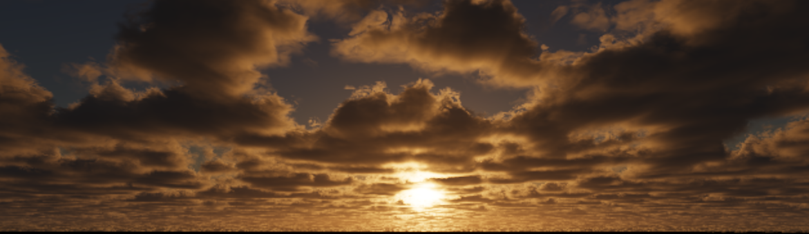
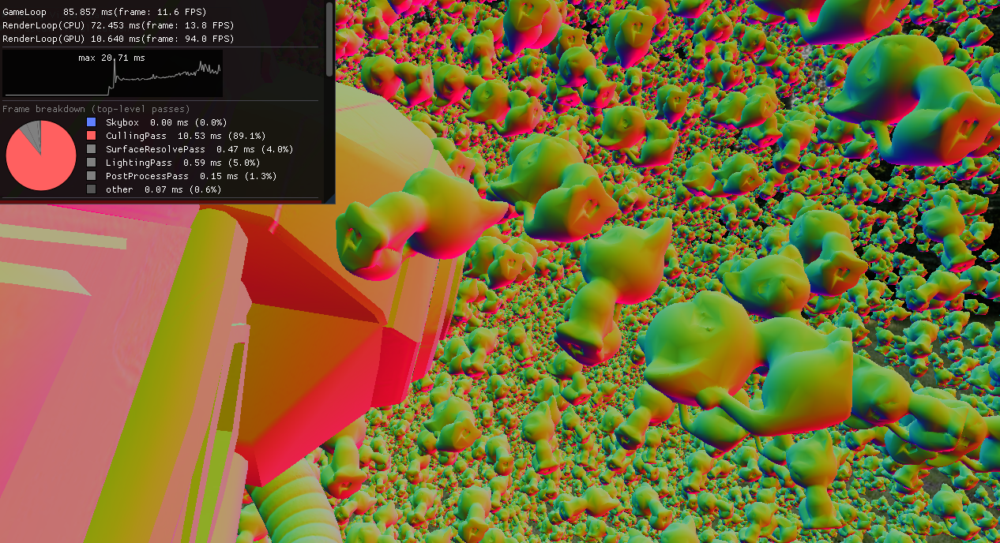
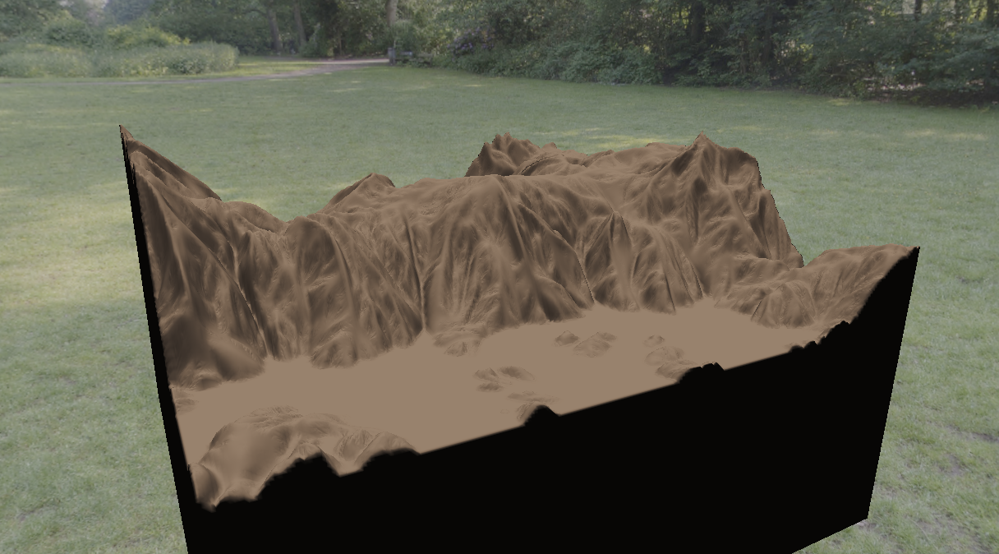
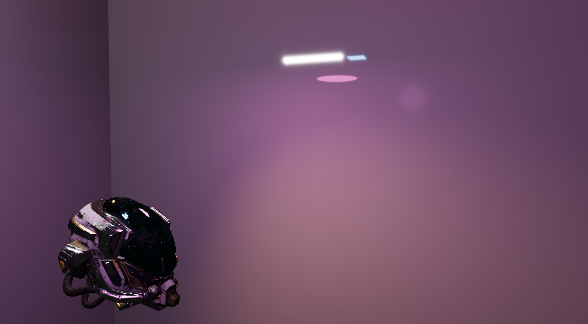
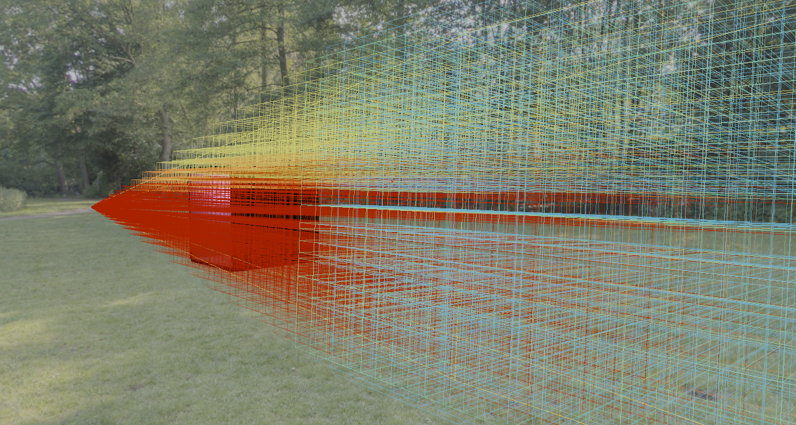
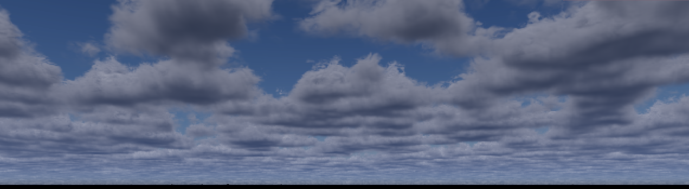
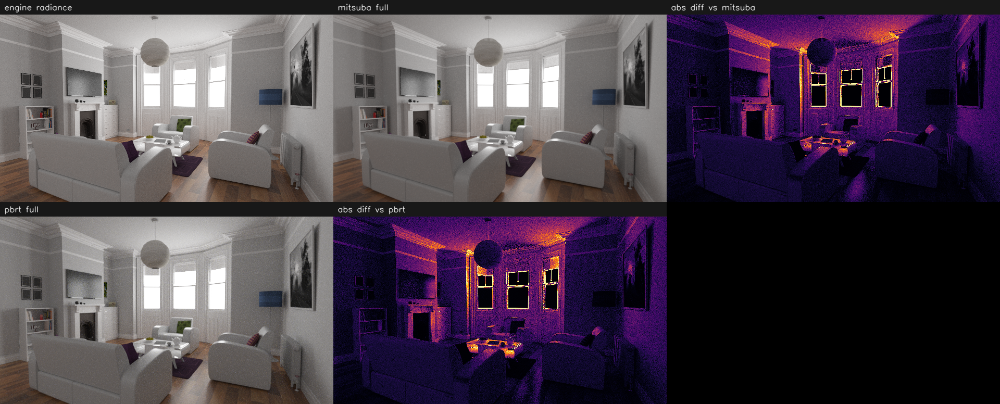
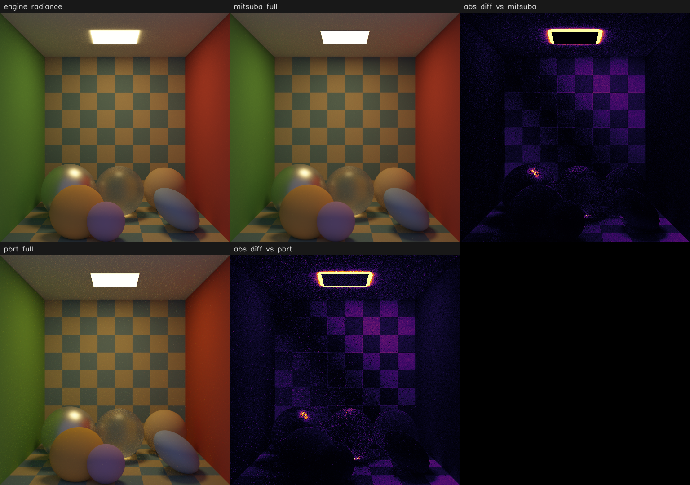
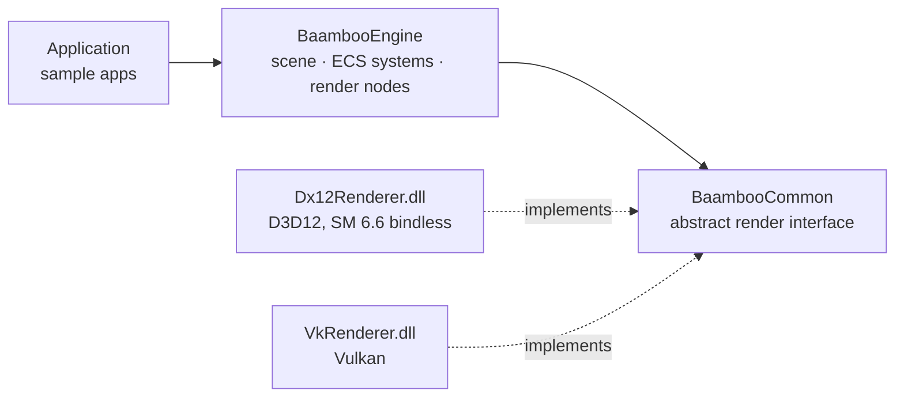

# BaambooRenderer

> Development status: Direct3D 12 is the primary backend; Vulkan and selected advanced samples remain experimental while correctness hardening continues.

A real-time rendering engine written from scratch in **C++23**, with a primary **Direct3D 12** backend (Shader Model 6.6, fully bindless) and an experimental **Vulkan 1.4** backend behind a single abstract rendering interface.

The end goal, and the motivation behind this project: learning how **high-quality AAA open-world rendering** is built for high-end PCs — using this engine as a long-term **sandbox for researching and implementing state-of-the-art graphics techniques**.




## Highlights

### Visibility-Buffer Deferred Pipeline

The geometry pass writes a compact **visibility buffer** (packed surface + primitive IDs and motion vectors) instead of a fat G-buffer; a compute **surface-resolve** pass reconstructs each pixel's triangle analytically and caches normals/material data for lighting. Reverse-Z depth throughout.

- Triangle attributes reconstructed with analytic perspective-correct barycentrics and UV gradients — no per-pixel attribute storage
- Octahedral-encoded normals + packed material output, resolved only when downstream passes need them
- Voxel terrain pixels re-run the dicing math at resolve time, so shading normals exactly match the carved geometry

### GPU-Driven Geometry

Two-phase occlusion culling at **instance and meshlet granularity**, single-dispatch Hi-Z (AMD FidelityFX SPD), task/mesh-shader cluster culling, and screen-space-error LOD selection — every draw is GPU-generated via `ExecuteIndirect` / `vkCmdDrawMeshTasksIndirectCountEXT`.

- Two-phase scheme: render last-frame-visible first, rebuild Hi-Z, then re-test and disocclude — tracked down to per-meshlet granularity with a persistent visibility bitfield
- Hi-Z pyramid built in a single compute dispatch (FidelityFX SPD, min-reduction for reverse-Z)
- Task shader culls per meshlet (frustum / backface cone / Hi-Z) with wave-intrinsic compaction; mesh shader culls per triangle (backface + sub-pixel, `SV_CullPrimitive`)
- Meshlets and LOD chains (up to 8 levels) baked with meshoptimizer; LOD selected on GPU by projected screen-space error


<p align="center"><i>Meshlet-culling stress test (normals debug view) — built-in profiler showing per-pass frame breakdown</i></p>

### Procedural Voxel Terrain — Fully GPU-Generated

A 256³ voxel chunk is built entirely on GPU — **SDF density field → marching cubes → Morton-order triangle sort → meshlet packing** — then rendered through the *same* GPU-driven culling and mesh-shader path as authored meshes. Micro-detail erosion is applied by **crack-free adaptive tessellation (compute dicing)** in the task/mesh shaders.

- SDF density from derivative-aware fBm with domain warp; marching cubes extracts directly into persistent GPU vertex slabs — no CPU readback anywhere in the chain
- Triangles spatially re-ordered by a GPU Morton-order counting sort, then packed into meshlets on GPU for tight culling bounds
- Compute dicing: distance-based per-meshlet subdivision budgets with per-edge levels and neighbor snapping — T-junction-free by construction
- Erosion detail baked into a 2048² detail/ridge map (Runevision-style directional erosion filter), applied as displacement plus an analytic micro-noise layer

<details><summary>🚧 <b>In progress — multi-chunk streaming</b></summary>

The single-chunk pipeline (GPU generation, erosion, compute dicing) is complete; extending to multi-chunk residency and streaming on top of the existing slab-pool infrastructure.
</details>


<p align="center"><i>Single 256³ voxel chunk — GPU-generated geometry with erosion detail from compute dicing</i></p>

### Clustered Lighting & Area Lights

Clustered light culling (64 px tiles × 32 logarithmic depth slices, GPU-compacted light lists) feeding a full-screen compute PBR resolve; **six analytic light types with photometric units** (lux / lumens / Kelvin), including rect and disk area lights via **Linearly Transformed Cosines** (Heitz 2016).

- Cook-Torrance GGX shading; light influence radii derived from luminous flux ("Moving Frostbite to PBR")
- LTC area/disk lights with full horizon clipping; sphere/tube lights via representative-point specular with energy conservation
- Per-pixel composition of aerial perspective and cloud scattering in the lighting resolve

<table>
  <tr>
    <td></td>
    <td></td>
  </tr>
  <tr>
    <td align="center"><i>Analytic area lights (rect · disk · tube)</i></td>
    <td align="center"><i>Cluster debug overlay — per-cluster light-count heatmap</i></td>
  </tr>
</table>

### Sky & Volumetrics

Full **Hillaire-style (SIGGRAPH 2020) atmosphere LUT stack** — transmittance, multi-scattering, sky-view, aerial-perspective froxels, distant-sky-light ambient, and a per-frame skybox bake — plus **Nubis-style volumetric clouds** with multi-scattering octaves and temporal upscaling.

- Six-LUT atmosphere pipeline with Rayleigh + Mie + ozone profiles; expensive LUTs recompute only when parameters change
- Clouds: weather-map-shaped FBM noise volume, blue-noise-jittered raymarch, dual HG–Draine phase function, multi-scattering octaves, temporal upres to full resolution
- Per-frame 512² Beer shadow map from the sun's view (implemented ahead of its consumer passes)
- Dynamic skybox re-baked every frame from the sky-view LUT with an analytic sun disk; static HDR-cubemap path included


<p align="center"><i>Volumetric clouds — daytime, multi-scattering octaves with temporal upres</i></p>

### DXR Path Tracing

Iterative progressive path tracer (**NEE + power-heuristic MIS**, Russian roulette) with a composite multi-lobe BSDF — Burley diffuse, anisotropic GGX with VNDF sampling, smooth/rough dielectric, clearcoat, sheen — **validated against PBRT-v4 and Mitsuba 3 through automated SSIM gates (≥ 0.99)**.

- Composite BSDF with one-sample lobe selection and a combined PDF for MIS; supports both glTF-style and Disney-principled materials
- Environment maps importance-sampled via a precomputed 2D CDF; six analytic light types shared with the raster pipeline
- 15-channel AOV dumps to EXR (headless CLI) compared against PBRT-v4 / Mitsuba 3 renders of identical generated scenes — tooling in [PathTracer_Reference](https://github.com/baamdoo/PathTracer_Reference)
- Cached BLAS / on-demand TLAS management; progressive accumulation with automatic invalidation on camera or scene changes

<details><summary>🚧 <b>In progress — n-layered substrate material</b></summary>

The single-layer composite BSDF is complete and reference-validated; extending it to an n-layered slab material model.
</details>


<p align="center"><i>The White Room — engine radiance vs Mitsuba 3 / PBRT-v4 references with absolute-difference maps</i></p>


<p align="center"><i>Material test box (conductor · rough dielectric · principled) — engine vs Mitsuba 3 / PBRT-v4</i></p>

### Post-Processing

- Antialising with TAA with Halton jitter, Catmull-Rom history resampling, and YCoCg variance clipping.
- Visual improvement with EV100 exposure with selectable ACES / Uncharted 2 / Reinhard / Uchimura tonemapping operations.


## Architecture



- **One interface, two backends** — engine and application code only touch abstract `render::` types; the D3D12 and Vulkan implementations are separate DLLs loaded at runtime (version-checked ABI), switchable per launch
- **Two binding models, one shader logic** — the D3D12 backend is fully bindless (`ResourceDescriptorHeap`, SM 6.6, heap indices as root constants); the Vulkan backend uses descriptor indexing (unbounded, partially-bound texture arrays) — the same passes exercise both models
- **Decoupled game & render loops** — the game loop publishes frame data to a bounded queue consumed by a dedicated render thread. Snapshot ownership and synchronization are active hardening areas.
- **ECS scene** built on EnTT with signal-driven dirty tracking and cross-system dependency propagation
- **Backend synchronization abstraction** — D3D12 enhanced barriers are the primary path; Vulkan `synchronization2` support is experimental and undergoing barrier and lifetime hardening.
- **Built-in profiling & debug tooling** — GPU draw/meshlet stats read back through a frames-in-flight ring, automatic frame-time anomaly capture, and debug overlays including a frozen-camera frustum mode for inspecting occlusion culling

## Sample Applications

| Sample | Focus |
|---|---|
| `ExampleApp` | Default scene — atmosphere, volumetric clouds, dynamic skybox, clustered lighting |
| `BistroApp` | Load test for the meshlet-culling pipeline — massively instanced scenes stressing two-phase culling and LOD selection |
| `LightingApp` | Clustered light culling, LTC area lights |
| `TerrainApp` | Fully GPU-driven procedural voxel terrain — erosion detail, compute dicing |
| `RayTracingApp` | DXR progressive path tracer, with AOV-dump automation for reference validation |

## Building

**Requirements**

- Windows 10/11, Visual Studio 2022 (C++23)
- [Vulkan SDK](https://vulkan.lunarg.com/) — `VULKAN_SDK` environment variable must be set (used for GLSL → SPIR-V compilation and the Vulkan backend)
- A DXR-capable GPU for the ray tracing sample

```bat
git clone --recursive https://github.com/baamdoo/BaambooRenderer.git
cd BaambooRenderer
Run GenerateProject.bat
```

Open `Baamboo.sln`, build, and run the `Application` project. The active sample is selected in `Projects/Applications/main.cpp`. NuGet packages (D3D12 Agility SDK, DXC, DirectXTK12, DirectXTex) are restored automatically on first build.

## Third-Party

[assimp](https://github.com/assimp/assimp) · [EnTT](https://github.com/skypjack/entt) · [GLFW](https://github.com/glfw/glfw) · [glm](https://github.com/g-truc/glm) · [Dear ImGui](https://github.com/ocornut/imgui) · [meshoptimizer](https://github.com/zeux/meshoptimizer) · [stb](https://github.com/nothings/stb) · [gli](https://github.com/g-truc/gli) · [magic_enum](https://github.com/Neargye/magic_enum) · [taskflow](https://github.com/taskflow/taskflow) · [nlohmann/json](https://github.com/nlohmann/json) · [pugixml](https://github.com/zeux/pugixml) · [tinyexr](https://github.com/syoyo/tinyexr) · [D3D12MemoryAllocator](https://github.com/GPUOpen-LibrariesAndSDKs/D3D12MemoryAllocator) · [VulkanMemoryAllocator](https://github.com/GPUOpen-LibrariesAndSDKs/VulkanMemoryAllocator)
